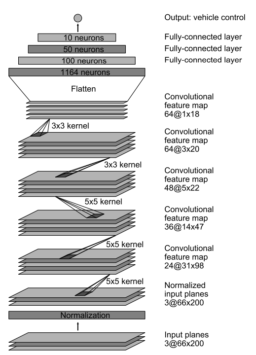
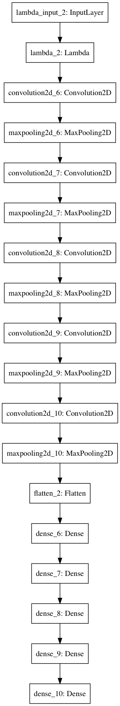
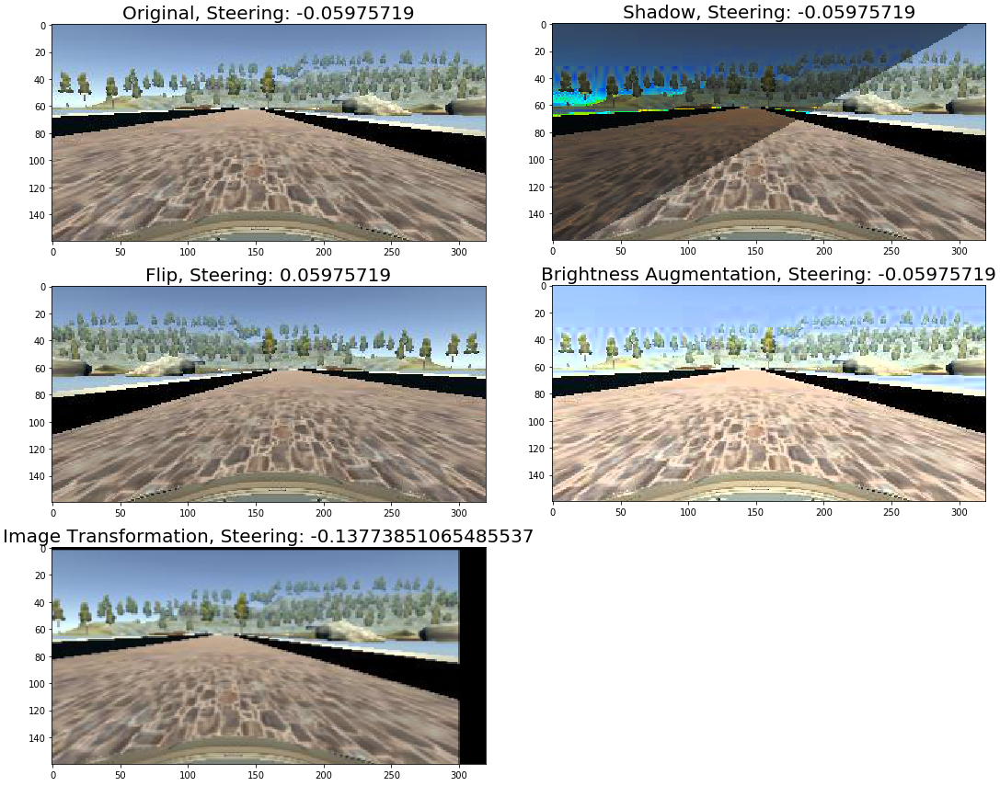

# **Behavioral Cloning**

The goals / steps of this project are the following:
* Use the simulator to collect data of good driving behavior
* Build, a convolution neural network in Keras that predicts steering angles from images
* Train and validate the model with a training and validation set
* Test that the model successfully drives around track one without leaving the road

### Rubric Points
Here I will consider the [rubric points](https://review.udacity.com/#!/rubrics/432/view) individually and describe how I addressed each point in my implementation.  

---
###Files Submitted & Code Quality

####1. Submission includes all required files and can be used to run the simulator in autonomous mode

My project includes the following files:
** model.py**: containing the script to create and train the model
** drive.py**: for driving the car in autonomous mode
** model.h5**: containing a trained convolution neural network 
** writeup_report.md**: summarizing the results
**video.mp4**: A video recording of the vehicle driving autonomously one lap around the track

####2. Submission includes functional code
Using the Udacity provided simulator and my drive.py file, the car can be driven autonomously around the track by executing 
```sh
python drive.py model.h5
```
####3. Submission code is usable and readable

The model.py file contains the code for training and saving the convolution neural network. The file shows the pipeline I used for training and validating the model, and it contains comments to explain how the code works.

---

###Model Architecture and Training Strategy

####1. An appropriate model architecture has been employed

I used a convolutional network similar to the [Nvidia's Self-Driving Cars](https://arxiv.org/pdf/1604.07316v1.pdf). The architecture of the network is:
 


**My convolutional network is :**


####2. Attempts to reduce overfitting in the model

The model was trained and validated on different data sets to ensure that the model was not overfitting. The model was tested by running it through the simulator and ensuring that the vehicle could stay on the track.

####3. Model parameter tuning

The model used an adam optimizer, so the learning rate was not tuned manually. The parameters to preprocess the images were cuatiously tuned to meet the best performance requirement on the road.

####4. Appropriate training data

Training data was chosen to keep the vehicle driving on the road. I used a combination of center lane driving, recovering from the left and right sides of the road.

###Model Architecture and Training Strategy

####1. Solution Design Approach

My first step was to use a convolution neural network model similar to the Nvidia's model.

In order to gauge how well the model was working, I split my image and steering angle data into a training and validation set. After training the model with the original dataset collect from the driving simulator, I found that only using the original dataset has very low ability in autonomous mode. So then I chose both the images from right and left camera to augment the train data. That works better but still can be improved. More augmentation wre adopted to make the CNN more robust.

When the trainging images increas, genertator is necessary to prevent OOM.

At the end of the process, the vehicle is able to drive autonomously around the track without leaving the road.

####2. Creation of the Training Set & Training Process

To augment the data sat, I also flipped images, increased the brightness of the images, shift transformated horizontal and vertical of the images, randomly add shadows to the images. When using the right and left cameras, the orientation is also added to or subtracted from a tuned number.I used an adam optimizer so that manually training the learning rate wasn't necessary.

When generating training images, every image in one batch of the generator is generated as follows: 1. randomly choose a right/middle/left camera, and add or subtracta tuned angles according to the original steering angle. 2. convert the image to RGB. 3. transform the image. 4. randomly augment the brightness of the image. 5. randomly filp the image.

One example of preprocessed image:


Then I used generators to feed the dataset to the model. I used 8 epochs, each eopch has 20000 training data and 400 validation data.

After training, in the automomous driving mode, the car can drive on the road well as video.mp4 shows.

